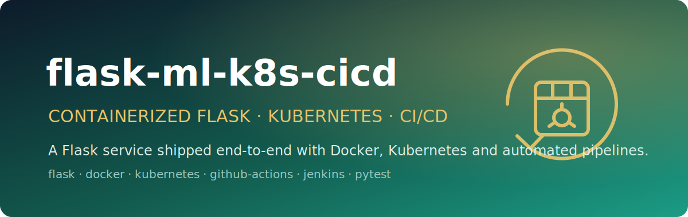

<p align="center">
  
</p>

<h1 align="center">flask-ml-k8s-cicd</h1>

<p align="center"><em>A containerized Flask service shipped end-to-end with Docker, Kubernetes, and automated CI/CD.</em></p>

<p align="center">
  
  
  
  
  
</p>

A minimal **Flask** web service wrapped in a complete **DevOps / MLOps delivery pipeline**: a multi-stage **Docker** build, **Kubernetes** manifests for a 3-replica rolling deployment, **GitHub Actions** for continuous integration (lint + tests + image build), and a **Jenkins** pipeline for continuous delivery. The app exposes a JSON root endpoint and a `/health` probe; the substance of the project is the automation that builds, tests, ships, and orchestrates it.

> Cloud MLOps assignment — the focus is the end-to-end CI/CD path from `git push` to a rolling Kubernetes deployment, not the application logic.

---

## ✨ Features

- **Tiny Flask API** — `GET /` returns a JSON `Hello, World!` payload; `GET /health` returns a `200` health check used by Kubernetes probes.
- **Multi-stage Docker build** — `python:3.9-slim` builder + slim runtime, dependencies installed into `--user` site-packages and copied across, image exposes port `5000`.
- **Production-style Kubernetes deployment** — 3 replicas, `RollingUpdate` strategy (`maxSurge: 1`, `maxUnavailable: 1`), CPU/memory requests & limits, and liveness/readiness probes against `/health`.
- **NodePort service** — exposes the deployment on `nodePort: 30001` with `ClientIP` session affinity for load balancing across pods.
- **Continuous Integration** — GitHub Actions runs flake8 linting (`--max-line-length=90`), pytest, and a Docker image build on every push.
- **Continuous Delivery** — a Jenkins declarative pipeline (Checkout → Build → Test) for the deploy stage.

## 🏗️ Architecture

```
   git push / PR
        │
        ▼
┌─────────────────────────┐      ┌──────────────────────────┐
│  GitHub Actions (CI)    │      │  Jenkins (CD)            │
│  • flake8 lint          │      │  • Checkout              │
│  • pytest               │      │  • Build                 │
│  • docker build         │      │  • Test → deploy         │
└───────────┬─────────────┘      └────────────┬─────────────┘
            │                                  │
            ▼                                  ▼
     ┌────────────┐                  ┌──────────────────────┐
     │  Docker    │                  │   Kubernetes (Minikube) │
     │  image     │───────────────▶ │   Deployment: flask-app │
     │  :5000     │                  │   replicas: 3 (rolling) │
     └────────────┘                  └───────────┬──────────┘
                                                 │
                                                 ▼
                                     ┌──────────────────────┐
                                     │ Service: flask-app-   │
                                     │ service (NodePort     │
                                     │ 30001 → :5000)        │
                                     └──────────────────────┘
```

## 🚀 Run it

**Locally with Python**

```bash
pip install -r requirements.txt
python app.py
# serves on http://localhost:5000
```

**With Docker**

```bash
docker build -t flask-app:latest .
docker run -p 5000:5000 flask-app:latest
# GET http://localhost:5000  ->  {"message":"Hello, World!","status":"success"}
# GET http://localhost:5000/health  ->  {"status":"healthy"}
```

**On Kubernetes (Minikube)**

```bash
minikube start
eval $(minikube docker-env)          # build into Minikube's Docker daemon
docker build -t flask-app:latest .   # image uses imagePullPolicy: Never

kubectl apply -f kubernetes/deployment.yaml
kubectl apply -f kubernetes/service.yaml

kubectl get pods,deployments,services
minikube service flask-app-service   # open the app
```

Scale, roll out, and roll back:

```bash
kubectl scale deployment flask-app --replicas=4
kubectl rollout status deployment/flask-app
kubectl rollout undo deployment/flask-app
```

## 🧪 Tests

```bash
pytest test_app.py -v
```

`test_app.py` uses Flask's test client to assert that `/` returns `200` with `Hello, World!` and that `/health` returns `200` with `healthy`.

## 🔧 CI/CD

**GitHub Actions** (`.github/ci.yml`) runs on every push and on PRs into `develop`/`main`:

1. Set up Python 3.9 and install `requirements.txt`
2. `flake8 . --max-line-length=90`
3. `pytest test_app.py -v`
4. `docker build -t flask-app:latest .`

A second workflow (`.github/workflows/docker-image.yml`) builds the Docker image with a timestamped tag on pushes/PRs to `main`.

**Jenkins** (`Jenkinsfile`) defines a declarative pipeline with `Checkout`, `Build`, and `Test` stages for the continuous-delivery path into Kubernetes.

## 📦 Repository structure

```
app.py                              # Flask app: / and /health
test_app.py                         # pytest test client suite
requirements.txt                    # Flask, pytest, flake8
Dockerfile                          # multi-stage python:3.9-slim build
Jenkinsfile                         # CD pipeline (Checkout/Build/Test)
.github/ci.yml                      # CI: lint + test + docker build
.github/workflows/docker-image.yml  # CI: timestamped image build
kubernetes/
  ├── deployment.yaml               # 3-replica rolling deployment + probes
  └── service.yaml                  # NodePort service (30001 → 5000)
```
